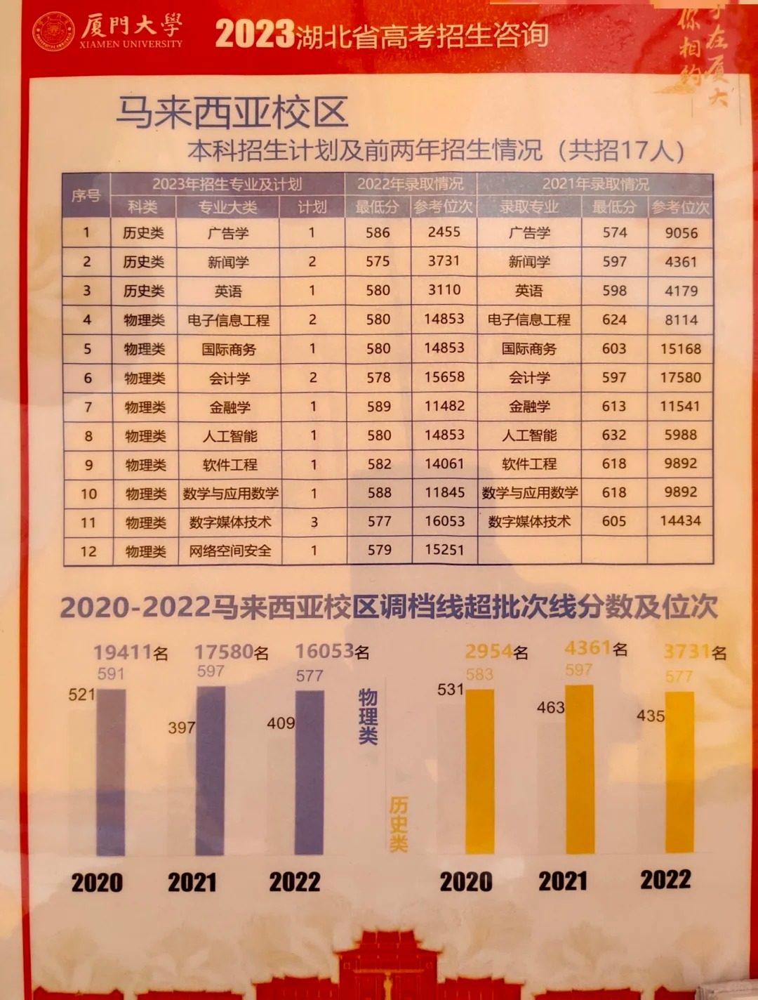
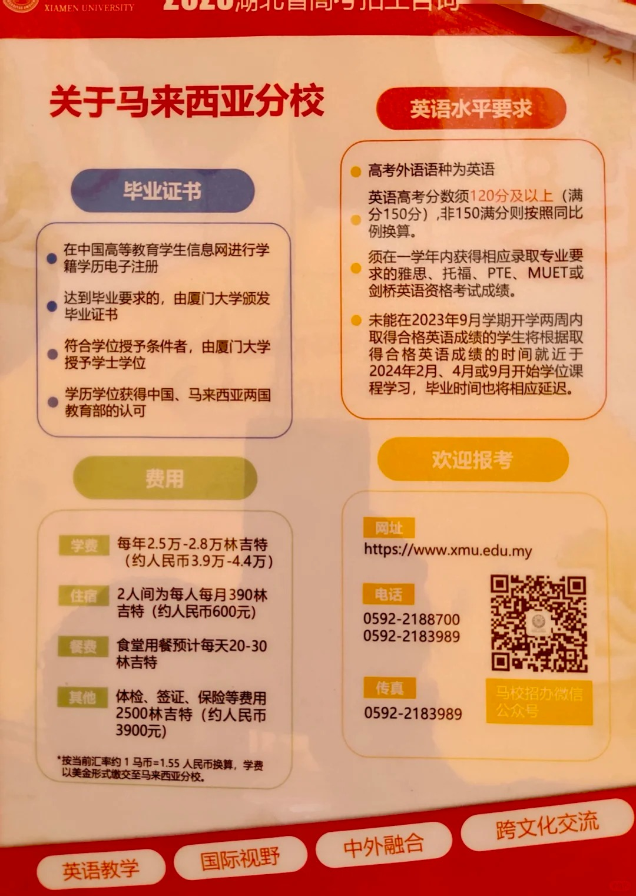
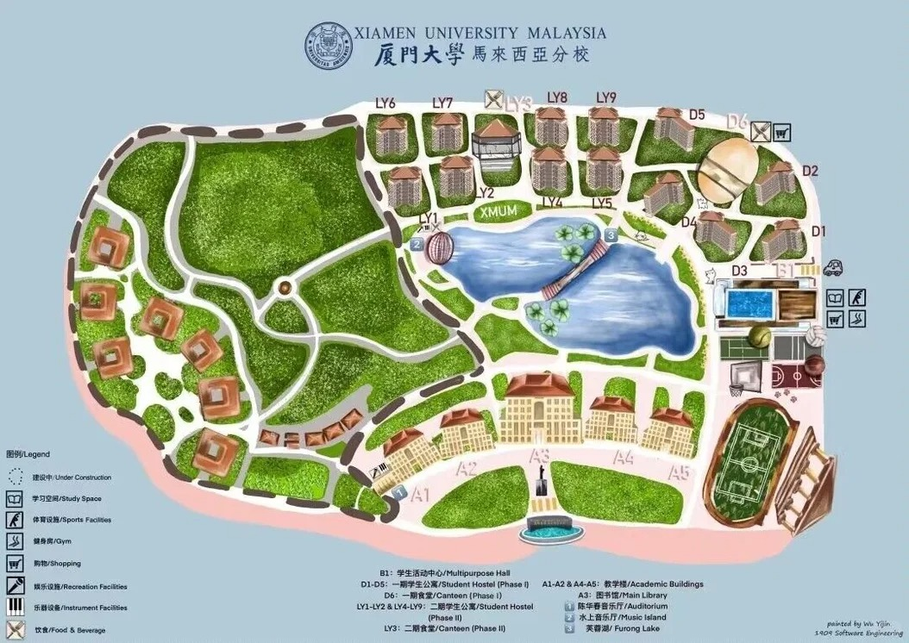
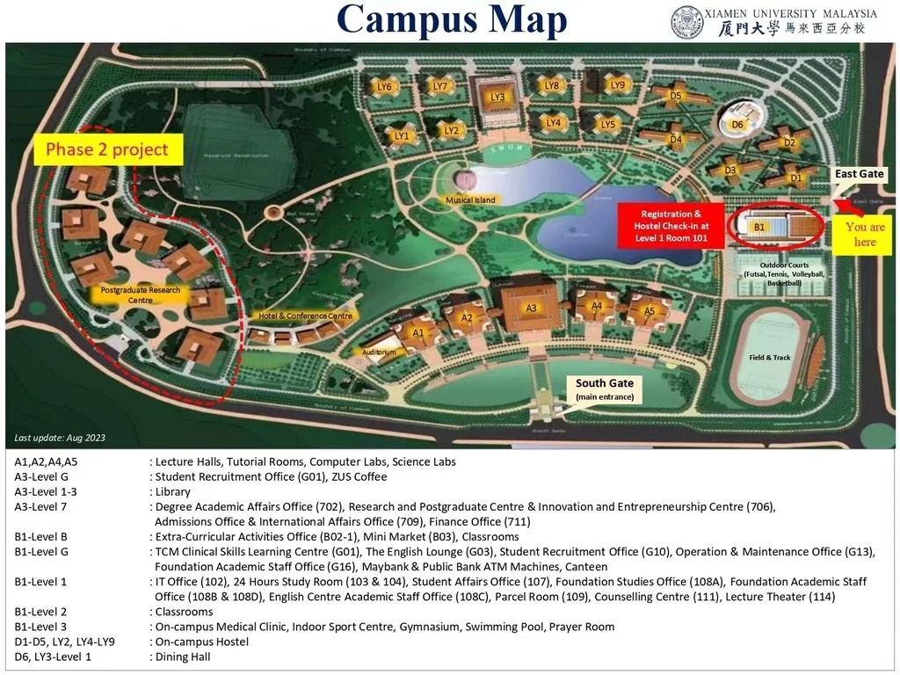
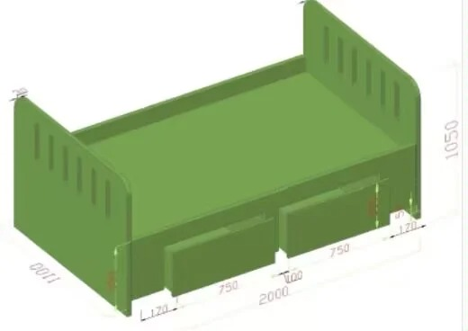
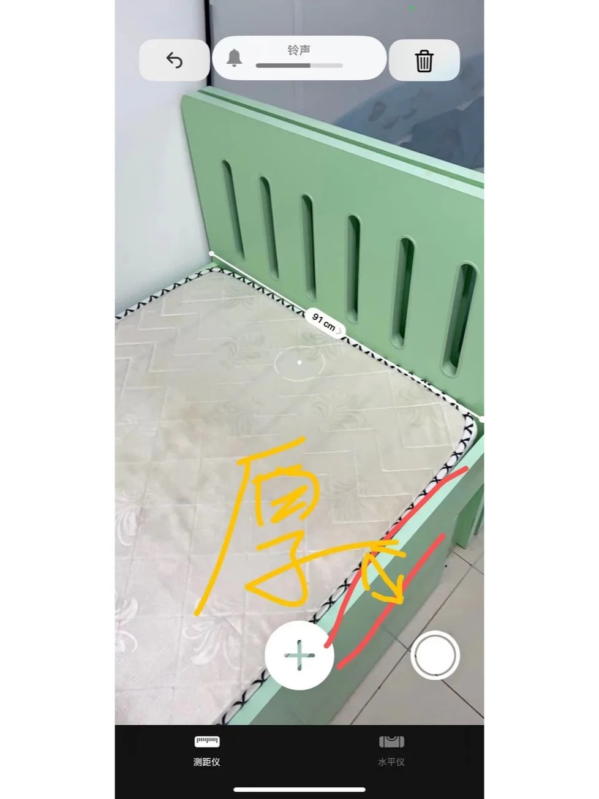

# SurviveXMUM
厦门大学马来西亚分校自救指南

## 简介
欢迎来到厦门大学马来西亚分校自救指南！本项目旨在为厦大马校的同学们提供一个全面的信息共享平台，帮助大家更好地适应和享受在马校的学习与生活。

## 目录
- [SurviveXMUM](#survivexmum)
  - [简介](#简介)
  - [目录](#目录)
  - [如何使用本指南](#如何使用本指南)
  - [指南内容](#指南内容)
    - [择校篇](#择校篇)
    - [人生篇](#人生篇)
    - [入学篇](#入学篇)
    - [生活篇](#生活篇)
    - [研学篇](#研学篇)
    - [专研篇](#专研篇)
    - [升学篇](#升学篇)
    - [走进社会篇](#走进社会篇)
  - [如何贡献](#如何贡献)
  - [许可证](#许可证)
  - [未来计划](#未来计划)

## 如何使用本指南
本指南通过 Markdown 文件组织。您可以直接浏览各个章节，或者使用上方的目录快速跳转到您感兴趣的部分。我们鼓励您使用搜索功能（如果平台支持）来查找特定信息。

## 指南内容

### 人生篇
- 关于厦马
- 985毕业证？留学跳板？你想在厦马有何收获?
- 信息素养
    - 打破信息差
    - 提问的智慧
- ...

### 择校篇
- 高考招生咨询
    - 2023年湖北省
    
    
    
### 入学篇
- 行前指南
    - 签证
    - 英语（雅思/托福/PTE)
    - ...
#### 校园地图

#### 科系简写
| 缩写 | 名称                     |
|--------------|----------------------------------|
| ACC          | 会计                            |
| ADT          | 广告                            |
| AIT          | 人工智能科技                      |
| CHS          | 中文系                          |
| CME          | 化学工程                         |
| CST          | 计算机科学                       |
| CYS          | 网络空间安全                      |
| DSC          | 数据科学                         |
| DMT          | 多媒体科技                       |
| ECM          | 电子商务                         |
| EEE          | 电子信息                         |
| EGE          | 新能源                          |
| ENG          | 英文                            |
| FIA          | 文科&社会科学预科班                |
| FIN          | 金融                            |
| FIS          | 理科预科班                       |
| IBU          | 国际商务                         |
| JRN          | 新闻                            |
| MAT          | 数学                            |
| MBA          | 工商管理硕士                      |
| MBT          | 海洋科技                         |
| MEC          | 海洋科学/海洋环境化学             |
| PHY          | 物理                            |
| SWE          | 软件工程                         |
| TCM          | 中医                            |
- 中国新生迎新系统
- 常见问题
- ...

### 生活篇
- 马来西亚生活（交通/支付/医疗）
#### 学校设施（客观介绍）
##### LY宿舍
###### 床

- 学校周边

### 研学篇
#### 学校已购软件
##### Microsoft Office 365 (Only Windows Users)
##### Canvas
- 使用学校邮箱 @xmu.edu.my 注册
- 加入Teams: Xiamen University Malaysia
- 自学的快乐
- 实用网站
    - 例如：Slidesgo，diagram.net
- 善用工具
    - Word 进阶功能 (目录，Reference...)
    - DeepL
    - Grammarly
    - Notion
    - LaTex
    - 知云文献翻译器
    - AI (ChatGPT/Claude/Gemini/Copilot/DeepSeek...)
    - ...
- 领导力和团队合作
    - ...
- 大学的终极项目：毕设
    - 如何获取学院的老师的研究方向
    - 如何根据自身情况选择导师
    - ...
- GPA的计算
- GE课程的选课技巧和隐藏规则
- 如何转专业
- AC 系统使用
- 寻找科研和项目经验
- 突击备考
- ...

### 专研篇
- 能源和化工学院
- 经济和管理学院
- 艺术和社会学院
- 计算和数据科学学院
- 沟通学院
- 电子工程和人工智能学院
- 中医学院
- 数学和物理学院
- 预科（未来考虑到本地同学和非大陆地区国际生）

### 升学篇
- 继续留学
    - 为什么继续留学
        - 国家/地区的选择
        - 读什么学位/专业
        - 润学
    - 你需要在就读厦马期间做什么准备
        - 外语考试
            - 英语（雅思/托福/PTE)
            - 德语
            - 日语
        - GRE
        - 科研
        - 竞赛
        - 推荐信
        - 实习
    - 警惕中介
    - 如今国际局势下的留学新常态
- 保研
    - GPA 和排名
    - 竞赛
    - 科研
    - 夏令营
- 考研
    - 择校经验

### 走进社会篇
- 经典面试问题
- 寻找实习机会
    - 寻找实习需要做的准备
    - ...
- 毕业后直接工作
    - 常见问题

## 如何贡献
我们非常欢迎您为本指南贡献内容！您可以通过以下方式参与：
1.  **Fork 本仓库**：将本仓库 Fork到您自己的 GitHub 账户。
2.  **创建分支**：从 `main` 分支创建一个新的特性分支（例如 `feature/add-canteen-info`）。
3.  **修改内容**：在您的分支上进行修改和补充。
4.  **提交更改**：提交您的更改，并撰写清晰的提交信息。
5.  **发起 Pull Request**：将您的分支推送到您的 Fork仓库，并向本仓库的 `main` 分支发起 Pull Request。

请确保您的贡献内容准确、客观、实用。

## 许可证
本项目采用 [GNU GENERAL PUBLIC LICENSE Version 3](LICENSE) 许可证。

## 未来计划
我们计划在不久的将来将本指南的内容迁移到 Wiki 百科的形式，以便更方便地进行协作编辑和信息查阅。敬请期待！